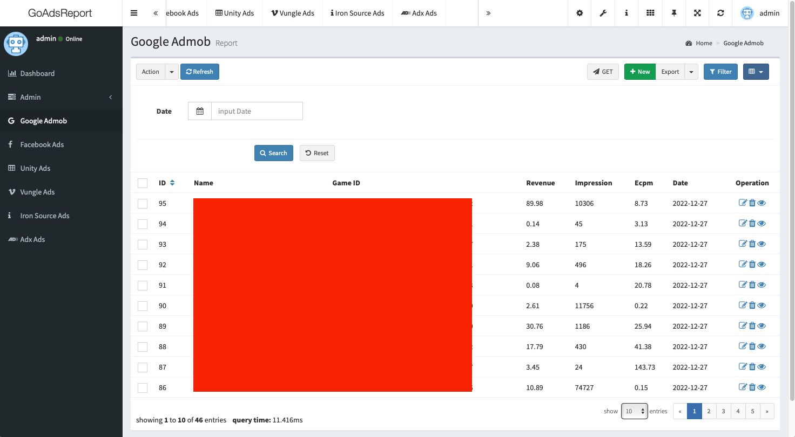

# ads-report-go
[](https://goreportcard.com/report/github.com/coolishbee/ads-report-go)

Advertising revenue report admin using [GoAdmin](https://github.com/GoAdminGroup/go-admin) framework and ads report api.

## Installation
```
$ git clone https://github.com/coolishbee/ads-report-go.git
```

## How to run

### Required

- MariaDB

### Ready

Create a **database** and import [SQL](https://github.com/coolishbee/ads-report-go/blob/main/sql/ads_report_2022-12-28.sql)

### Conf

You should modify `adm.ini`

```
[database]
Driver = mysql
Host = 127.0.0.1
Username = root 
Port = 
Password = 
Database = ads_report
...
```

### Run
```
$ cd $GOPATH/src/go-gin-sample
$ go run main.go
```



## Features

- [Unity](https://docs.unity.com/ads/en/MonetizationStatsAPI.html) Ads Report API
- [Vungle](https://support.vungle.com/hc/en-us/articles/211365828-Publisher-Reporting-API-2-0) Report API
- [Iron](https://developers.is.com/ironsource-mobile/air/reporting/) Report API
- [Adx](https://developer.adxcorp.kr/report) Report API
- [Admob](https://developers.google.com/admob/api/v1/reference/rest/v1/accounts.networkReport/generate) Report API

## TODO

- Facebook